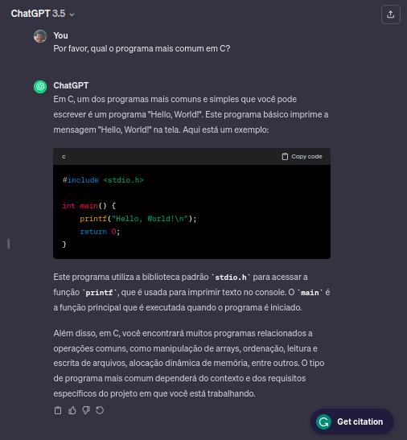
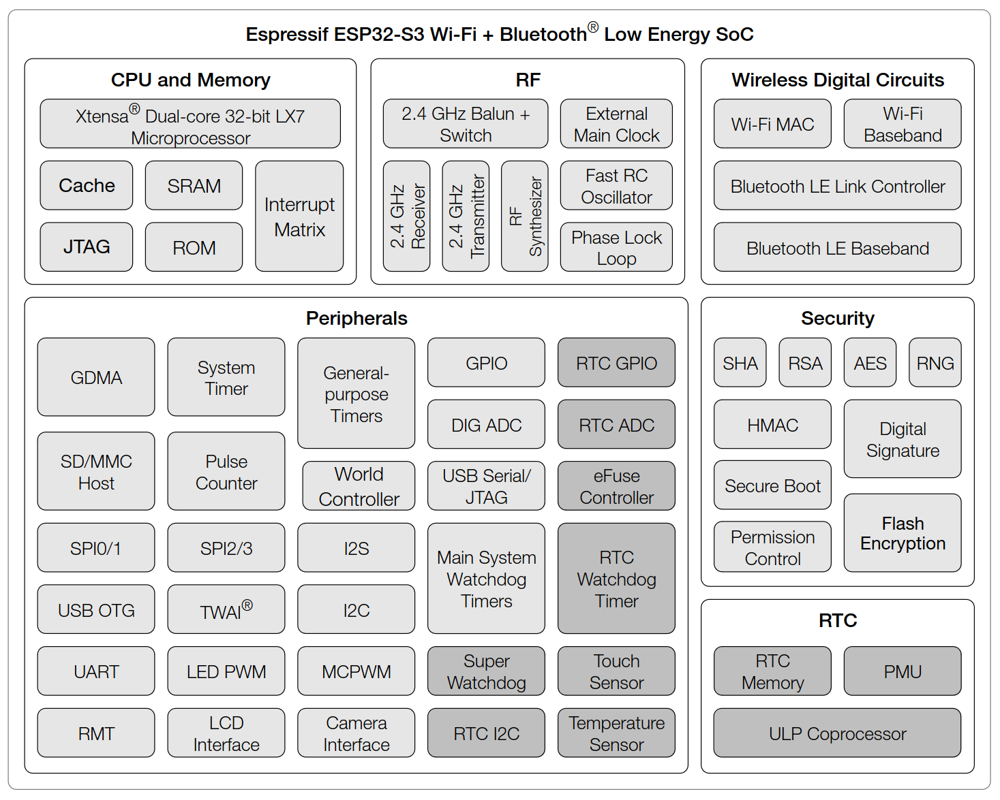
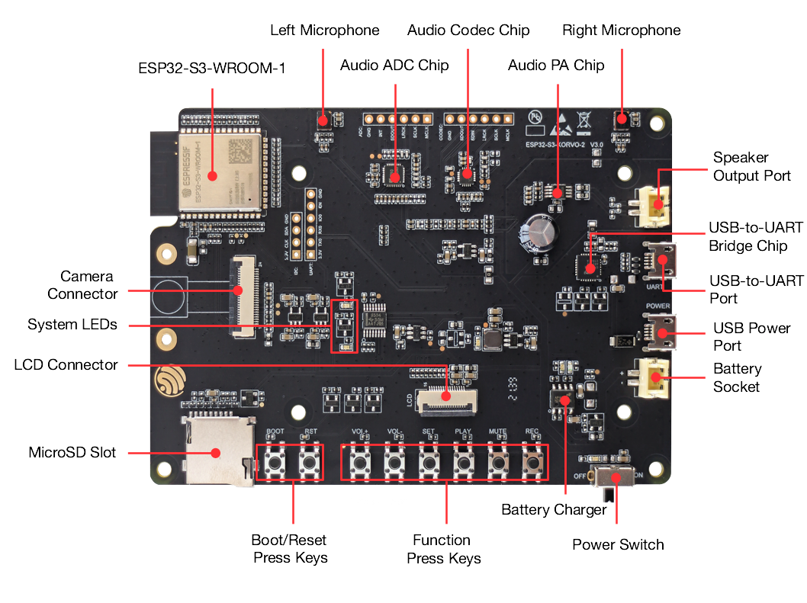

<!-- _class: lead -->

# Introdução ao NuttX

## Espressif Summit Brasil 2024

---

<!-- paginate: true -->
<!-- footer: Espressif Summit Brasil 2024 -->

## Quem somos?

### Tiago Medicci
Engenheiro Eletricista e Mestre em Eng. Eletrônica pela Unicamp. Amante de eletrônica e áudio. Maker. Engenheiro de Software na Espressif.

### Filipe Cavalcanti
Engenheiro Eletricista e Mestre em Eng. Elétrica pela Universidade Federal da Paraíba. Engenheiro de Software na Espressif. Aspirante a guitarrista.

---

## O que é o NuttX?

*ChatGPT-generated? Yes* :innocent:

O NuttX é um sistema operacional em tempo real (RTOS) que visa fornecer uma plataforma escalável e eficiente para sistemas embarcados. Ele é baseado no padrão POSIX e é projetado para ser altamente configurável e "portável".

---

### RTOS?

#### Software Embarcado

- Bare-metal
- Sistemas operacionais
  - Sistemas operacionais de tempo real (RTOS)
  - Linux Embarcado

---

### RTOS (Real-Time Operating System)

#### Wikipedia (em tradução livre):

> Sistemas operacionais em tempo real são orientados a eventos e preemptivos, o que significa que o sistema operacional pode monitorar a prioridade relevante de tarefas concorrentes e fazer alterações na prioridade da tarefa. Sistemas orientados a eventos alternam entre tarefas com base em suas prioridades, enquanto sistemas de compartilhamento de tempo alternam a tarefa com base em interrupções de relógio.

[Wikipedia: Real-time operating system](https://en.wikipedia.org/wiki/Real-time_operating_system), acesso em 08/01/2024.

---

<style scoped>
table {
  font-size: 19px;
}
</style>

| Operating system | First commit | Governance    | License                    | Contributors | Pulse*(jun10/2024) |
|------------------|--------------|---------------|----------------------------|--------------|--------------------|
| Zephyr           | 2014         | community     | Apache 2.0                 | 100+         | 942                |
| **NuttX**        | **2007**     | **community** | **Apache 2.0**             | **100+**     | **135**            |
| RT-Thread        | 2009         | community     | Apache 2.0                 | 100+         | 67                 |
| RIOT             | 2010         | community     | LGPL2.1                    | 100+         | 71                 |
| Tyzen RT         | 2015         | Samsung       | Apache 2.0                 | 100+         | 36                 |
| myNewt           | 2015         | Community     | Apache 2.0                 | 100+         | 25                 |
| mbed OS          | 2013         | ARM           | Apache 2.0 or BSD-3 Clause | 100+         | 7                  |
| FreeRTOS         | 2004         | Richard Barry | MIT                        | 100+         | 6                  |
| Contiki-NG       | 2016         | community     | BSD-3 Clause               | 100+         | 4                  |
| CMSIS-5          | 2016         | ARM           | Apache 2.0                 | 100+         | 0                  |
| Azure-RTOS       | 2020         | Microsoft     | Microsoft Software License | 10+          | archived           |

<style scoped>
section {
  font-size: 20px;
}
</style>

***Pulse** é uma métrica que avalia atividades no repositório, como pull-requests e issues durante um certo tempo.

---

## Por que o NuttX?

- Licença: Apache 2.0
- Small footprint
  - Suportado do Z80 a RISC-V 64 bits
- Ampla comunidade

**E...** :arrow_heading_down:

---

<style>
img[alt~="center"] {
  display: block;
  margin: 0 auto;
}
</style>


---

```c
#include <stdio.h>

int main() {
    printf("Hello, World!\n");
    return 0;
}
```



---

**Ainda perguntando ao chatGPT...** :thinking:


---


```c
#include <stdio.h>
#include <stdlib.h>
#include <string.h>
#include <unistd.h>
#include <arpa/inet.h>

#define PORT 8080
#define MAX_BUFFER_SIZE 1024

int main() {
    int server_socket, client_socket;
    struct sockaddr_in server_addr, client_addr;
    char buffer[MAX_BUFFER_SIZE];

    // Criação do socket
    if ((server_socket = socket(AF_INET, SOCK_STREAM, 0)) == -1) {
        perror("Erro ao criar o socket");
        exit(EXIT_FAILURE);
    }

    // Configuração do endereço do servidor
    server_addr.sin_family = AF_INET;
    server_addr.sin_addr.s_addr = INADDR_ANY;
    server_addr.sin_port = htons(PORT);

    // Associação do socket ao endereço
    if (bind(server_socket, (struct sockaddr*)&server_addr, sizeof(server_addr)) == -1) {
        perror("Erro ao associar o socket ao endereço");
        exit(EXIT_FAILURE);
    }

    // Coloca o socket em modo de escuta
    if (listen(server_socket, 5) == -1) {
        perror("Erro ao colocar o socket em modo de escuta");
        exit(EXIT_FAILURE);
    }

    printf("Servidor escutando na porta %d...\n", PORT);

    // Aguarda a conexão do cliente
    socklen_t client_addr_len = sizeof(client_addr);
    if ((client_socket = accept(server_socket, (struct sockaddr*)&client_addr, &client_addr_len)) == -1) {
        perror("Erro ao aceitar a conexão do cliente");
        exit(EXIT_FAILURE);
    }

    printf("Cliente conectado: %s\n", inet_ntoa(client_addr.sin_addr));

    // Loop para receber e enviar dados de volta ao cliente
    while (1) {
        ssize_t bytes_received = recv(client_socket, buffer, MAX_BUFFER_SIZE, 0);
        if (bytes_received <= 0) {
            printf("Conexão encerrada pelo cliente.\n");
            break;
        }

        printf("Recebido: %s", buffer);

        send(client_socket, buffer, bytes_received, 0);
        memset(buffer, 0, sizeof(buffer));
    }

    // Fechamento dos sockets
    close(client_socket);
    close(server_socket);

    return 0;
}
```

---

## Por que o NuttX?

- Licença: Apache 2.0
- Small footprint
  - Suportado do Z80 a RISC-V 64 bits
- Ampla comunidade

**E...**

---

## Por que o NuttX?

- Licença: Apache 2.0
- Small footprint
  - Suportado do Z80 a RISC-V 64 bits
- Ampla comunidade
- **Compatível com o padrão POSIX!**

---

### POSIX?

De novo, da *Wikipedia* :memo::

> POSIX (um acrônimo para: Portable Operating System Interface, que pode ser traduzido como Interface Portável entre Sistemas Operativos) é uma família de normas definidas pelo IEEE para a manutenção de compatibilidade entre sistemas operacionais e designada formalmente por IEEE 1003. POSIX define a interface de programação de aplicações (API), juntamente com shells de linha e comando e interfaces utilitárias, para compatibilidade de software com variantes de Unix e outros sistemas operacionais.

https://pt.wikipedia.org/wiki/POSIX, acesso em 13 de janeiro de 2024.

---

### POSIX! :raised_hands:

De novo, da wikipedia:

> **Tem como objetivo garantir a portabilidade do código-fonte de um programa a partir de um sistema operacional que atenda às normas POSIX para outro sistema POSIX, desta forma as regras atuam como uma interface entre sistemas operacionais distintos.**

https://pt.wikipedia.org/wiki/POSIX, acesso em 13 de janeiro de 2024.

---

### POSIX :heart:

<sub>*O Super Trunfo do NuttX!* :punch:</sub>

#### [Reinventing the wheel](https://en.wikipedia.org/wiki/Reinventing_the_wheel) :negative_squared_cross_mark:

Alguém já teve que fazer ~~quase~~ a mesma aplicação que você!

#### [Code reuse](https://en.wikipedia.org/wiki/Code_reuse) :white_check_mark:

Provavelmente, esta aplicação já foi desenvolvida para sistemas operacionais Unix com interfaces POSIX :wink:

---

### Hello World!

Sim, existe um exemplo de Hello World para o NuttX!

Em `nuttx-apps/examples/hello/hello_main.c`:

```c
#include <nuttx/config.h>
#include <stdio.h>

int main(int argc, FAR char *argv[])
{
  printf("Hello, World!!\n");
  return 0;
}
```

---

#### Primeiros Passos com o *Hello World*


```shell
# Limpa o diretório de trabalho
make -j distclean

# Configurar o exemplo base
./tools/configure.sh esp32s3-devkit:espressif_summit

# Selecionar o exemplo de Hello World
make menuconfig

# Compilar e gravar o firmware
make flash ESPTOOL_PORT=/dev/ttyUSB0 -j$(nproc)

# Acessar o terminal
minicom
```

---


#### Primeiros Passos com o *Hello World*

<style scoped>
pre {
  font-size: 60%;
}
</style>

```shell
nsh> help
help usage:  help [-v] [<cmd>]

    .           cp          expr        ln          ps          true
    [           cmp         false       ls          pwd         truncate
    ?           dirname     fdinfo      mkdir       readlink    uname
    alias       dd          free        mkfifo      rm          umount
    unalias     df          help        mkrd        rmdir       unset
    arp         dmesg       hexdump     mount       set         uptime
    basename    echo        ifconfig    mv          sleep       usleep
    break       env         ifdown      nslookup    source      wget
    cat         exec        ifup        pidof       test        xd
    cd          exit        kill        printf      time

Builtin Apps:
    hello       nsh         ping        renew       sh          wapi
    iwasm       nxplayer    rand        rtpdump     stat        wget
nsh> hello
Hello, World!!
nsh>
```

---

#### Ainda o *Hello World* - ELF Loader

O NuttX permite que aplicações sejam carregadas dinamicamente. Ou seja, o NuttX permite:
1) Criar um firmware base que carregue as aplicações dinamicamente (de uma memória externa, por exemplo)
2) Atualizar uma aplicação sem atualizar o firmware por inteiro

---

#### Ainda o *Hello World* - ELF Loader

```shell
# Após compilar o NuttX, exporte as configurações e biblioteca utilizadas
make export
```

Um arquivo `.tar.gz` será gerado no diretório raiz. Este compilado contém os arquivos necessários para compilar uma aplicação a ser carregada dinamicamente.

---

<style scoped>
pre {
  font-size: 60%;
}
</style>

#### Ainda o *Hello World* - ELF Loader

O exemplo a seguir contém o programa *Hello World* e um `Makefile` com o seguinte conteúdo:

```make
include nuttx-export-10.4.0/scripts/Make.defs

ARCHINCLUDES += -isystem nuttx-export-10.4.0/include
CFLAGS = $(ARCHCFLAGS) $(ARCHWARNINGS) $(ARCHOPTIMIZATION) $(ARCHCPUFLAGS) $(ARCHINCLUDES) $(ARCHDEFINES) $(EXTRADEFINES)
CELFFLAGS = $(CFLAGS) -mtext-section-literals

OBJEXT ?= .o

# This is the generated ELF program

BIN = hello
SRCS = hello.c
OBJS = $(SRCS:.c=$(OBJEXT))

# Build targets

all: $(BIN)
.PHONY: clean

$(OBJS): %$(OBJEXT): %.c
	$(Q) $(CC) -c $(CELFFLAGS) $< -o $@

$(BIN): $(OBJS)
	$(LD) $(LDFLAGS) $(LDELFFLAGS) -o $@ $^
```

---


#### Ainda o *Hello World* - ELF Loader

Conectando na rede Wi-Fi

```shell
nsh> wapi psk wlan0 tijolo22 3
nsh> wapi essid wlan0 NuttX 1
nsh> renew wlan0
nsh> ifconfig
wlan0   Link encap:Ethernet HWaddr 34:85:18:42:f9:e4 at RUNNING mtu 1504
        inet addr:192.168.1.210 DRaddr:192.168.1.1 Mask:255.255.255.0

             IPv4   TCP   UDP  ICMP
Received     0002  0000  0002  0000
Dropped      0000  0000  0000  0000
  IPv4        VHL: 0000   Frg: 0000
  Checksum   0000  0000  0000  ----
  TCP         ACK: 0000   SYN: 0000
              RST: 0000  0000
  Type       0000  ----  ----  0000
Sent         0002  0000  0002  0000
  Rexmit     ----  0000  ----  ----
```

---


#### Ainda o *Hello World* - ELF Loader

Executando o programa `Hello World` compilado externamente:

```shell
nsh> ls /data
/data:
 .
 ..
 wapi.conf
nsh> wget /data/hello2 http://192.168.1.155:8000/hello
nsh> ls /data/
/data:
 .
 ..
 hello2
 wapi.conf
nsh> /data/hello2
Hello, World!!
nsh>
```

---

#### Ainda o *Hello World* - WebAssembly

*WebAssembly?*

De https://webassembly.org/:
> WebAssembly (abbreviated Wasm) is a binary instruction format for a stack-based virtual machine. Wasm is designed as a portable compilation target for programming languages, enabling deployment on the web for client and server applications.

Ou seja, permite que um programa seja compilado para o formato WebAssembly e, então, executado em máquinas que possuem uma máquina virtual capaz de interpretar este formato.

---


#### Ainda o *Hello World* - WebAssembly

###### Compilando o programa *Hello World* para `Wasm`:

```bash
export WASI_SDK_PATH=/home/tiago/Downloads/wasi-sdk-22.0-linux/wasi-sdk-22.0
CC=("${WASI_SDK_PATH}/bin/clang" "--sysroot=${WASI_SDK_PATH}/share/wasi-sysroot")
"${CC[@]}" hello.c -o hello.wasm

# Executando o programa no computador

$ iwasm hello.wasm
Hello, World!!
```

###### Baixando e executando o programa no NuttX:

```shell
nsh> wget /data/hello.wasm http://192.168.1.155:8000/hello.wasm
nsh> iwasm /data/hello.wasm
Hello, World!!
```

---

## (Um pouco mais de) Por que o NuttX?

- Loadable kernel modules, lightweight, embedded shared libraries
- Configurações de Memória: (1) Flat build, (2) Protected build com MPU, e (3) Kernel build com MMU
  - *Flat* RTOS ou compilado separadamente, como um kernel seguro monolítico com uma interface de chamadas de sistema (system calls)
- On-demand paging
- Suporte a diversos Sistema de Arquivos
  - `NXFFS`, `SMART`, `SPIFFS`, `LittleFS`, `ROMFS`, `TMPFS`, etc
- USB Host e USB Device
- Subsistema de gráficos e áudio

---

## Espressif e o NuttX :computer:

- **Outubro, 2016**
Primeiro commit pelo próprio Gregory Nutt (criador do NuttX), um mês após o lançamento do ESP32
- **Outubro, 2021**
 Espressif anuncia oficialmente suporte aos OSes NuttX e Zephyr (além do ESP-IDF, que continua sendo o OS oficial da Espressif para seus SOCs)
- **Julho, 2024**
NuttX possui suporte a ESP32, ESP32-S2, ESP32-S3, ESP32-C3, ESP32-C6 e ESP32-H2

---

#### Complete os espaços em branco :writing_hand:

*"Ah, mas o meu programa é muito específico! Ele lê um dado do sensor ________ pela interface ________ e depois manda para ________ via ________."*

OK, mas alguém *provavelmente*:
1. Já implementou um driver para ler o sensor em sistema Linux (incluindo o acesso à interface)
2. Já criou uma aplicação que recebe dados genéricos e os processa (enviando através de alguma interface de rede, por exemplo)

---

##### Por exemplo...

###### Placa de som via Wi-Fi :speaker:

Utilizar um ESP32 como uma placa de áudio externa que recebe pacotes via rede Wi-Fi e reproduzi-lo em um codec de áudio I2S.

**Trabalhoso?** :tired_face:

---

###### Solução :clipboard:

Existe (desde 1996) um protocolo de rede chamado *RTP* (Real-Time Protocol) que é capaz de enviar e receber pacotes de áudio pela rede.

 [***RTP Tools***](https://github.com/irtlab/rtptools)

*RTP Tools is a set of small applications that can be used for processing RTP data.*

:arrow_right: Utiliza interfaces POSIX para receber pacotes RTP pela rede

---

###### RTP Tools no NuttX? Como? :nerd_face:

Artigo no *embarcados.com.br* :books:

[***NuttX: Criando (ou Copiando!) uma Aplicação para o NuttX***](https://embarcados.com.br/nuttx-criando-ou-copiando-uma-aplicacao-para-o-nuttx/)

> Da série de artigos em português no *embarcados.com.br*:
[*Primeiros Passos com o ESP32 e NuttX*](https://embarcados.com.br/serie/primeiros-passos-com-o-esp32-e-o-nuttx/)

---

###### Real-Time Protocol (RTP) :clipboard:

<iframe src="images/rtp.drawio.html" height="600px" width="100%" frameBorder="0"></iframe>

---

###### Real-Time Protocol (RTP) - Transmissor

- Ambiente
  - Computador com sistema operacional *Linux*
  - *PulseAudio* (gerenciador de áudio) instalado
  - Módulo *RTP Send*
- Envio de RTP no formato *Pulse-code modulation* (PCM)
  - 2 canais (estéreo)
  - 16 bits
  - Taxa de amostragem: 44,1 kHz
  - **Qualidade de CD!**

---

###### Real-Time Protocol (RTP) - Receptor

*RTP Tools* é composto por algumas aplicações, entre elas o `rtpdump`, que permite receber pacotes via RTP.

O conteúdo (*payload*) dos pacotes é, justamente, os pacotes de áudio PCM (não comprimidos), que pode ser encaminhado ao codec de áudio via periférico I2S e, então, o sinal analógico pode ser reproduzido em uma caixa de som.

```shell
nsh> rtpdump -h
usage: rtpdump [-F hex|ascii|rtcp|short|payload|dump|header] [-f infile] [-o outfile] [-t minutes] [-x bytes] [address]/port > file
```

---

## Mão na Massa! :construction_worker:

---

## Espressif ESP32-S3
- Wi-Fi (2.4 GHz)
- Bluetooth Low Energy
- Dual high performance Xtensa® 32-bit LX7 CPU cores
- Ultra Low Power co-processor
- Múltiplos Periféricos
- Interface USB OTG
- Controlador USB Serial/JTAG



---

## Espressif ESP32-S3-Korvo-2

- Codec de Áudio ES8311
  - Interface de controle: I2C
  - Interface de dados: I2S
- Amplificador de Áudio integrado
- Array de Microfones e ADC dedicado
- Cartão SD



---

### ESP32-S3 e o NuttX :computer:

[Documentação do ESP32-S3 no NuttX](https://nuttx.apache.org/docs/latest/platforms/xtensa/esp32s3/index.html):

<iframe src="https://nuttx.apache.org/docs/latest/platforms/xtensa/esp32s3/index.html" height="600px" width="100%" frameBorder="0"></iframe>

---


###### Real-Time Protocol (RTP) - Receptor

Criando um arquivo *FIFO* para receber os pacotes RTP:

```shell
nsh> mkfifo temp
```

Executando o `rtpdump` (em background) para receber os pacotes na porta `46998` e salvar no arquivo `temp`:

```shell
nsh> rtpdump -F payload -o temp /46998 &
rtpdump [15:100]
```

---


###### Real-Time Protocol (RTP) - Receptor

Neste momento, os pacotes de áudio PCM (recebidos via RTP) estão sendo escritos no arquivo *FIFO* `temp`.
Reproduzindo a partir da leitura do arquivo:

```shell
nsh> nxplayer
NxPlayer version 1.05
h for commands, q to exit

nxplayer> playraw temp 2 16 44100
```

---


###### Real-Time Protocol (RTP) - Receptor

O comando `playraw` do *NxPlayer* encaminha os dados do arquivo diretamente para o codec de áudio.
<!-- Os argumentos `2`, `16` e `44100` representam, respectivamente, a quantidade de canais (2 canais, estéreo), a quantidade de bits/sample (16) e a taxa de amostragem (44100 Hz). Estes parâmetros são, exatamente, os encontrados em um CD! -->

---

## Dúvidas, Perguntas e Sugestões :memo:

### Obrigado!


#### Tiago Medicci

 - [https://github.com/tmedicci](https://github.com/tmedicci)
 - [https://www.linkedin.com/in/tmedicci/](https://www.linkedin.com/in/tmedicci/)

#### Filipe Cavalcanti

 - [https://github.com/fdcavalcanti](https://github.com/fdcavalcanti)
 - [https://www.linkedin.com/in/fdcavalcanti](https://www.linkedin.com/in/fdcavalcanti)

---

## Referências Gerais

- Página Oficial do NuttX: [https://nuttx.apache.org/](https://nuttx.apache.org/)
- Documentação Oficial do NuttX: [https://nuttx.apache.org/docs/latest/](https://nuttx.apache.org/docs/latest/)
- Kernel do NuttX no GitHub: [https://github.com/apache/nuttx](https://github.com/apache/nuttx)
- Aplicações do NuttX no GitHub: [https://github.com/apache/nuttx-apps](https://github.com/apache/nuttx-apps)

<!-- _class: lead -->
